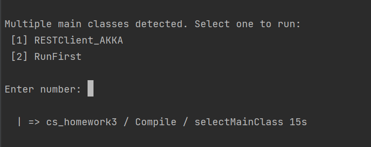
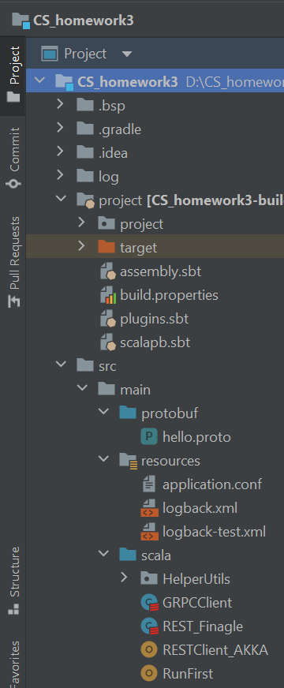
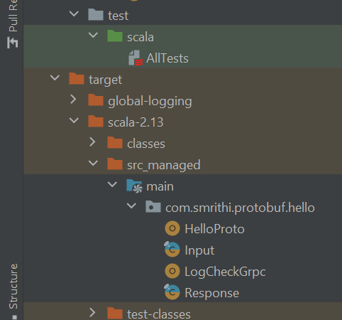
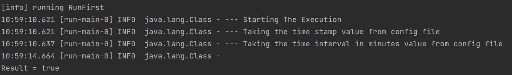
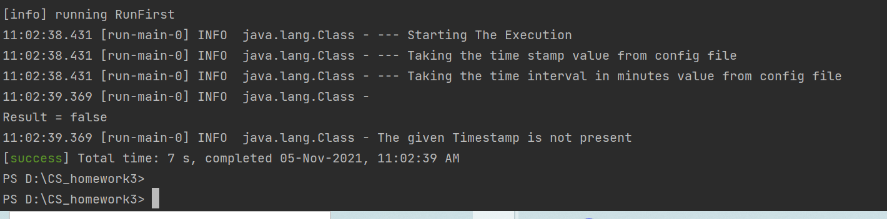
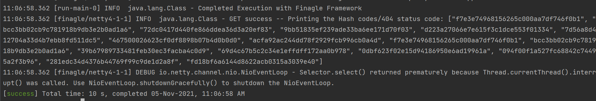
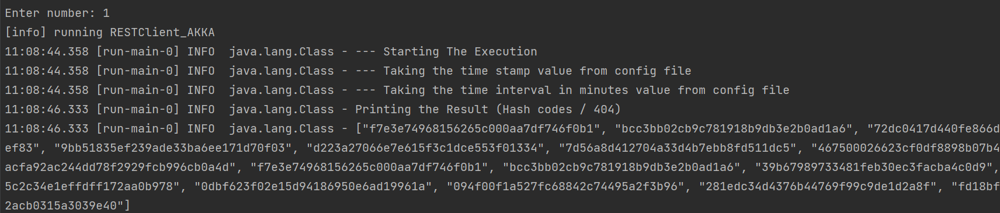
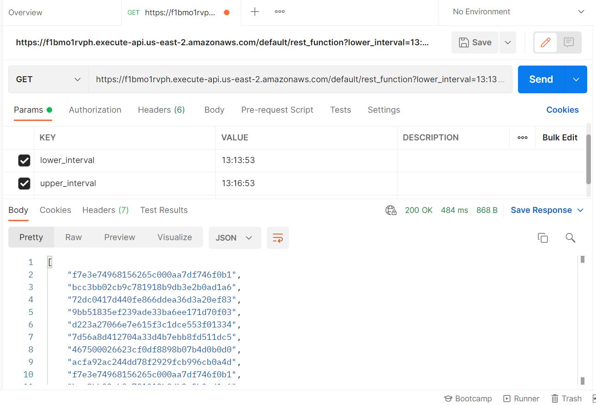

# CS 441 - Implementing GRPC Service using ProtoBuffers and RESTful service on Twitter Finagle Framework and AKKA HTTP Framework to invoke AWS Lambda Functions 
### GOAL
The goal of this project is to gain experience with solving a distributed computational problem using cloud computing technologies by designing and implementing a RESTful service and a lambda function that are accessed from clients using gRPC.

#### INSTALLATION AND RUNNING THE PROJECT
##### Prerequisites
- [SBT](https://www.scala-sbt.org/) installed on your system
- [AWS CLI](https://docs.aws.amazon.com/cli/latest/userguide/cli-chap-install.html) installed and configured on your system
- `protoc` should be installed
##### To Run
- Clone this repository https://github.com/smrithibalki/grpc_rest_implementation.git
- Browse to the project directory. Import in intelliJ
- Run the following commands : 
- ` sbt clean compile`
- `sbt run `
- After you run the above command , 2 options will be provided as below
- 
- Enter 2, to see the first the client call GRPC and when returned True, client call REST API via Finagle Framework
- Enter 1, to see the implementation of the REST API via the AKKA HTTP Framework

##### PROJECT STRUCTURE

 
- project build consists of all .sbt files with all plugins needed for the project
- assembly.sbt -- Plugin to generate a jar file
- scalapb.sbt -- ProtoBuf for Scala
- hello.proto -- Proto Buffer used for the GRPC.It has service definition , Request and Response
- resources -- It has the configuration files and XML files to support logs
- HelperUtills -- Utils file to Create Logger
###### Scala Files
###### RunFirst 
- Main class which takes the inputs like timestamp and timeinterval from configuration file 
- Creates a client with the url/endpoint as a parameter for GRPC
- If returned true, from GRPC client , creates a REST class with REST API endpoint as a url
###### GRPCClient
- In this class, client invokes the lambda function in AWS with the url specified.
- It's inpput is the ProtoBuf object(Request and Response Format)
- Returns a Boolean value
###### REST_Finagle
- Implements a RESTful service for retrieving log messages using one of the popular framework: Finagle.
###### RESTClient_AKKA
- Implements a RESTful service for retrieving log messages using one of the popular framework: AKKA.
- 
- test -- AllTests -- consists of Tests written
- com.smrithi.protobuf.hello - ProtoBuf generated files
##### PROJECT OVERVIEW
This project is an implementation of GRPC and RESTAPI for the communication of  client and server with Lambda functions.The flow of the project is as follows:
- An EC2 instance is created and the following link is cloned and run [LogFileGenerator](https://github.com/0x1DOCD00D/LogFileGenerator).
- This generates the log files which are stored in S3 buckets in AWS
- The client invokes a Lambda Function say(L1) via GRPC to check if the given TimeStamp exists in log files in the S3 bucket.
- If the TimeStamp exists, then the client invokes another Lambda Function say(L2) via REST where it checks if messages are present in the Time Interval specified
- If present, returns the MD5 generated hash code. Else, returns 404 HTTP status
##### LAMBDA FUNCTIONS 
##### L1 -/lambda_functions/binary_serach.py 
- This is uploaded as a zip file in AWS lambda along with the python depandency packages using the reference link below
- Binary Search is performed on the S3 bucket to check if the TimeStamp is present.
- Using the binary search we reduce the complexity of searching from O(N) to O(Log N).
- Line caching is performed to read a particular need line in the file rather than reading all contents of the file.
- Example  `linecache.getline(linecache.__file__, 8)` linecache takes 2 parameters, 1- filename and 2- line number.
- The return value of this Lambda function is a boolean value.
- True, if the TimeStamp exists. Else, false
##### L2 - /lambda_functions/rest_function.py
- This function is invoked only if the first Lambda function(L1) returns True.
- Binary search is performed on the files present in the S3 bucket to check if log messages exists between the specified Time interval.
- If present, returns  an MD5 generated hash code. else, returns HTTP 404 status.
- For the second Lamda function also the complexity is O(Log N), linecache is used to avoid reading all contents of the file.
- This functions stops reading the log messages when the minutes of the time interval exceeds. Returning the hash codes
###### Note
- Both the Lambda functions are written in PYTHON
- L1 is uploaded as a zip file

##### CLIENT via GRPC (Using Protobuf)
gRPC is a modern open source high performance Remote Procedure Call (RPC) framework that can run in any environment. It can efficiently connect services in and across data centers
Protobuf is the most commonly used IDL (Interface Definition Language) for gRPC. It's where you basically store your data and function contracts in the form of a proto file.
- It invokes the AWS lambda function to check if the TimeStamp is present
- It sends the protobuf which contains Request and Response
- Returns a boolean Value
##### CLIENT via REST (Twitter Finagle Framework)
Finagle is an extensible RPC system for the JVM. Finagle implements uniform client and server APIs for several protocols, and is designed for high performance and concurrency. 
Most of Finagle’s code is protocol agnostic, simplifying the implementation of new protocols.
- The client communicates with lambda functions with REST API calls on Twitter Finagle Framework.
- It returns MD5 hash codes or HTTP 404 statuscode.
Finagle is written in Scala, but provides both Scala and Java idiomatic APIs.
##### CLIENT via REST (AKKA HTTP Framework)
The Akka HTTP modules implement a full server- and client-side HTTP stack on top of akka-actor and akka-stream. 
It’s not a web-framework but rather a more general toolkit for providing and consuming HTTP-based services.
- The client communicates with lambda functions with REST API calls on AKKA HTTP Framework.
- It returns MD5 hash codes or HTTP 404 statuscode.

##### RESULTS
#### GRPC - Lambda Invocation
- Input   - TimeStamp - "13:14:53"
          - TimeInterval - 1 minute

- If TimeStamp exists

- Input   - TimeStamp - "23:56:53"
          - TimeInterval - 1 minute
- If TimeSTamp doesn't exists


#### REST via Finagle - Lambda Invocation
- Only invoked if received True from GRPC
- Input   - TimeStamp - "13:14:53"
          - TimeInterval - 1 minute

#### REST via AKKA HTTP - Lambda Invocation
- Only invoked if received True from GRPC
- Input   - TimeStamp - "13:14:53"
          - TimeInterval - 1 minute
- 

##### NOTE - The logs can be viewed in the log folder

##### EXPERIMENTS
POSTMAN RESULTS

EC2 Instances
CloudWatch Logs 
- Lambda function (L1)
- Lambda function (L2)

##### TEST
The tests can be viewed in /src/test/scala/AllTests

-- The following test cases are provided:
- Test for the timestamp pattern
- Test for the timestamp input
- Test for the timeinterval input in minutes 
- Check for GRPC Endpoint
- Check for plusMinutes and minusMinutes to calculate time intervals
- Check for REST Endpoint
- To run the testcases give the following command
```
sbt test
```

##### Reference Links
- [Protobuf](https://grpc.io/docs/what-is-grpc/introduction/)
- [LineCache](https://docs.python.org/3/library/linecache.html)
- [Finagle](https://twitter.github.io/finagle/guide/Quickstart.html)
- [AKKA-HTTP](https://doc.akka.io/docs/akka-http/current/introduction.html)
- [EC2-to-S3](https://www.middlewareinventory.com/blog/ec2-s3-copy/)
- [Guide](https://blog.sourcerer.io/full-guide-to-developing-rest-apis-with-aws-api-gateway-and-aws-lambda-d254729d6992)
- [Python_pkg_aws_lamda](https://towardsdatascience.com/how-to-install-python-packages-for-aws-lambda-layer-74e193c76a91)